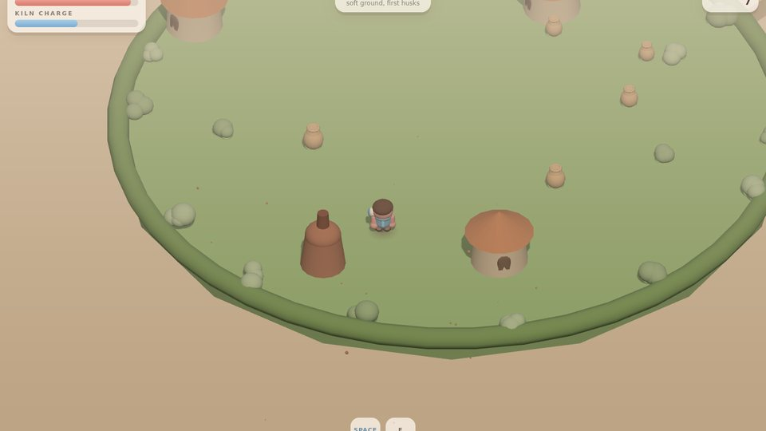

# Kilnheart

A clay-toy isometric action RPG that runs in the browser, plain ES modules on Three.js.

**Play it live:** https://kilnheart.bles-software.com/



You are a little clay hero. The Kiln is firing your world hard and hollow. Take the mallet, dash, burst and smash the husks back into soft clay.

## Run it

No build step. Serve the folder with any static server:

```bash
npx serve .
```

## Make it yours

MIT licensed. Fork it, reskin it, ship it, sell it. More open game worlds: https://worlds.bles-software.com/

Built by [Bles Software](https://bles-software.com).
